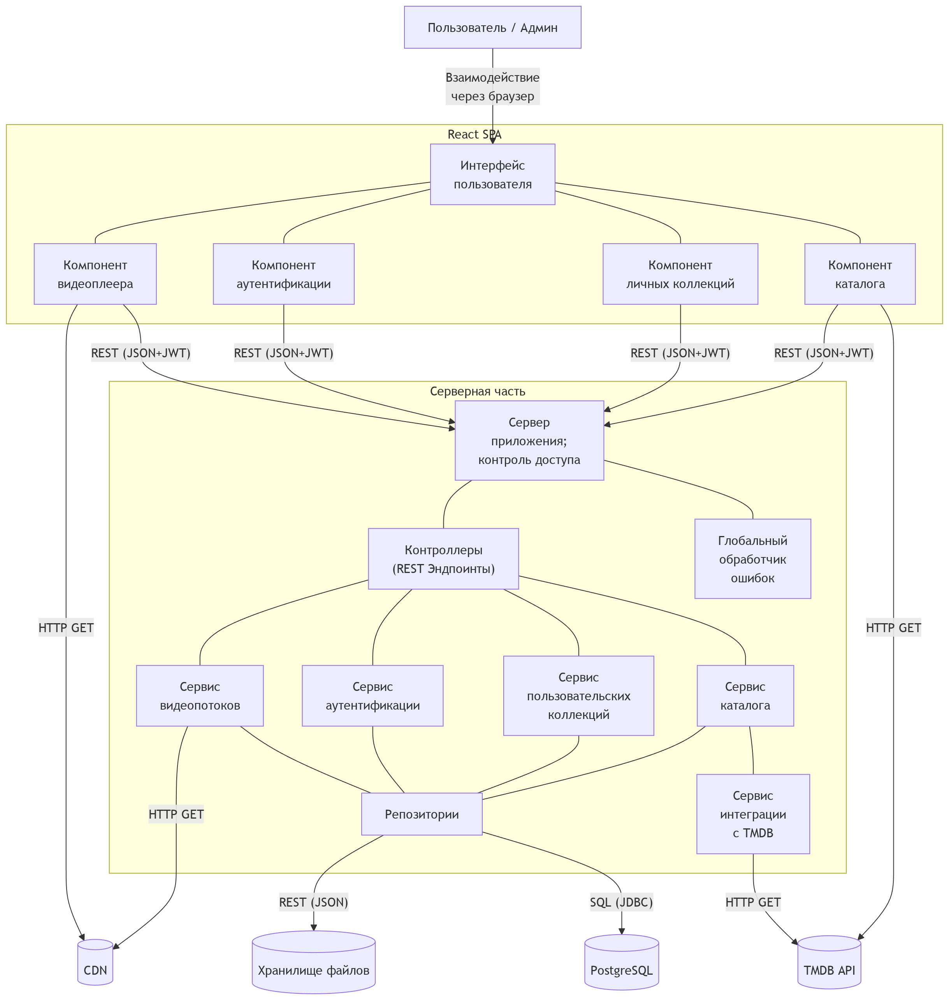
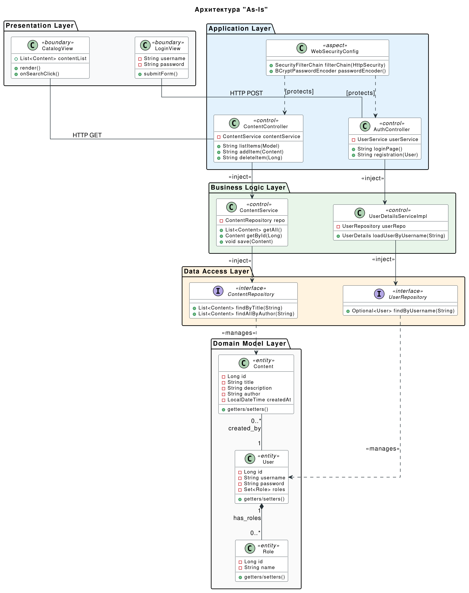

# ИССЛЕДОВАНИЕ АРХИТЕКТУРНОГО РЕШЕНИЯ

## 1. Архитектура "To Be"

### 1.1. Тип приложения

**Rich Web Application (Насыщенное веб-приложение)**, реализуемое по паттерну **SPA (Single Page Application)**.

- **Клиентская часть (React):** Берёт на себя всю логику отображения, маршрутизации (`React Router`) и управления состоянием пользовательского интерфейса.

- **Серверная часть (Spring Boot):** Выступает в роли REST API сервера, который обрабатывает бизнес-логику, управляет данными в БД и служит прокси-слоем для внешнего API (TMDB).

### 1.2. Стратегия развёртывания

Учитывая, что приложение не хранит видеофайлы, а только агрегирует данные и ссылки, оптимальным решением будет распределенное развертывание, в основе которого лежит контейнеризация (Docker) с разделением на независимые узлы:

- **Frontend-сервер** (Nginx / Vercel / AWS S3 + CloudFront): раздача статических файлов собранного React-приложения.

- **Backend-сервер** (VPS / Cloud Application Platform вроде Heroku или AWS ECS): запуск Spring Boot приложения (JAR-файла).

- **База данных** (PostgreSQL): реляционная БД для хранения пользователей, их коллекций (`SeriesCollection`) и истории просмотров (`UserWatchHistory`). Желательно использовать облачное Managed DB решение для автоматического бэкапа.

- **Хранилище файлов** (S3-совместимое): для хранения пользовательских аватаров чтобы избежать несогласованности при перспективном расширении на несколько серверов.

### 1.3. Обоснование выбора технологий

Выбор технологий полностью оправдан и отлично подходит под задачи бизнеса:

- **Frontend (React):** обеспечивает мгновенный отклик интерфейса (Требование 3.2.1.3), позволяет переиспользовать UI-компоненты (карточки актёров `ActorCard.js`, сериалов `LacornCard.js`) и легко интегрируется с REST API через слой `services/`.

- **Backend (Java + Spring Boot):** строго типизированный и надёжный фреймворк. Отлично подходит для реализации сложной логики авторизации, работы с реляционной БД (через Spring Data JPA / Hibernate) и безопасной интеграции со сторонними API (TMDB).

- **Интеграция (REST API + JWT):** JSON Web Tokens (реализован в `JwtUtil.java`) — стандарт де-факто для SPA. Позволяет серверу оставаться stateless (не хранить сессии), что упрощает масштабирование.

### 1.4. Показатели качества (Атрибуты качества)

Исходя из бизнес-требований, приоритетными являются следующие метрики:

- **Удобство использования (Usability):** адаптивная вёрстка, интуитивная навигация. Реализуется за счёт изоляции компонентов React и использования глобального состояния (например, `AuthContext.js`).

- **Безопасность (Security):** защита API-эндпоинтов, разграничение прав доступа (Админ/Пользователь — `HasRole.java`), защита от CSRF/XSS, CORS-политики (`CorsConfig.java`). Пользователь имеет доступ строго к своим коллекциям.

- **Доступность и производительность (Availability & Performance):** так как система зависит от внешнего TMDB API (Требование 2.4.4), критически важно обеспечить приемлемое время отклика даже при задержках со стороны TMDB.

### 1.5. Пути реализации сквозной функциональности

- **Аутентификация и Авторизация:** реализуется через `SecurityConfig.java` и `JwtAuthFilter.java`. Токен передаётся в заголовках `Authorization: Bearer <token>` при каждом запросе от React (`services/api.js`).

- **Управление исключениями:** единая точка обработки ошибок на бэкенде — `GlobalExceptionHandler.java`. Он перехватывает `CustomException` и `ResourceNotFoundException` и отдаёт фронтенду стандартизированный `ErrorResponseDTO`. На фронтенде это обрабатывается общим компонентом `ErrorMessage.js`.

- **Кэширование (Рекомендация):** чтобы не исчерпать лимиты TMDB API и ускорить загрузку (Требование 3.1.2), необходимо внедрить кэширование на уровне `TMDBIntegrationService.java` (например, с помощью `@Cacheable` и Redis/Caffeine) для популярных запросов (список новых сериалов, детали сериала).

- **Логирование:** использование SLF4J в Spring Boot для мониторинга ошибок API и действий пользователей.

### 1.6. Структурная схема приложения (в виде UML-диаграммы развертывания)

## 2. Архитектура "As Is"

### 2.1. Обобщенная диаграмма классов бекенда и фронтенда

## 3. Сравнение и рефакторинг

### 3.1. Ключевые отличия и причины изменений

1. Вынос логики из Frontend и безопасность TMDB
    - **Проблема**: В "As Is" клиент обращается к TMDB API напрямую. Это грех архитектуры, так как наш секретный API-ключ утекает в браузер пользователя, и любой может использовать его от нашего имени.
    - **Решение**: Вся логика обращения к TMDB с фронтенда инкапсулированна в отдельном сервисе интеграции с TMDB.
    - **Причина**: Безопасность и инкапсуляция. Клиент запрашивает данные у нашего бэкенда, а бэкенд (подставляя ключ в защищенной среде) проксирует запрос к TMDB. Это позволяет кэшировать ответы TMDB на своей стороне, экономя лимиты запросов. Кроме того, это поможет перебороть блокировку сервиса TMDB в некоторых странах, при которой сервис может работать некорректно.

2. Хранение контента (Аватары и Видео)
    - **Проблема**: Локальное хранение делает приложение не масштабируемым. Если мы запуститим второй экземпляр сервера, он не сможет получить доступ к файлам первого.
    - **Решение**: Внедрение CDN и Хранилища файлов (S3).
    - **Причина**: Отказоустойчивость. Аватары и статика должны лежать в объектном хранилище. Использование CDN (Content Delivery Network) для больших видеофайлов снимает нагрузку с основного сервера и ускоряет загрузку для пользователей.

### 3.2. Пути улучшения

Для дальнейшего развития проекта выбрана реализация следующих паттернов:

- Паттерн "Фасад" для внешних API: Создание в коде четкого интерфейсa для работы с TMDB. Если завтра мы решим сменить TMDB на Kinopoisk API или IMDb, нам придется переписать только один сервис, а не весь проект.

- Паттерн "Стратегия" для загрузки файлов: Реализация загрузки аватаров через интерфейс. Это позволит легко переключаться между LocalStorageManager (для тестов) и S3StorageManager (для продакшена).
